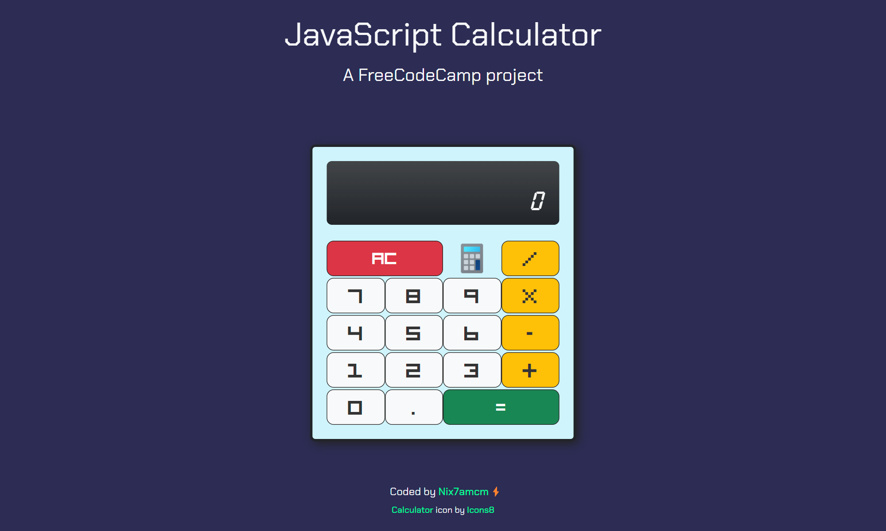
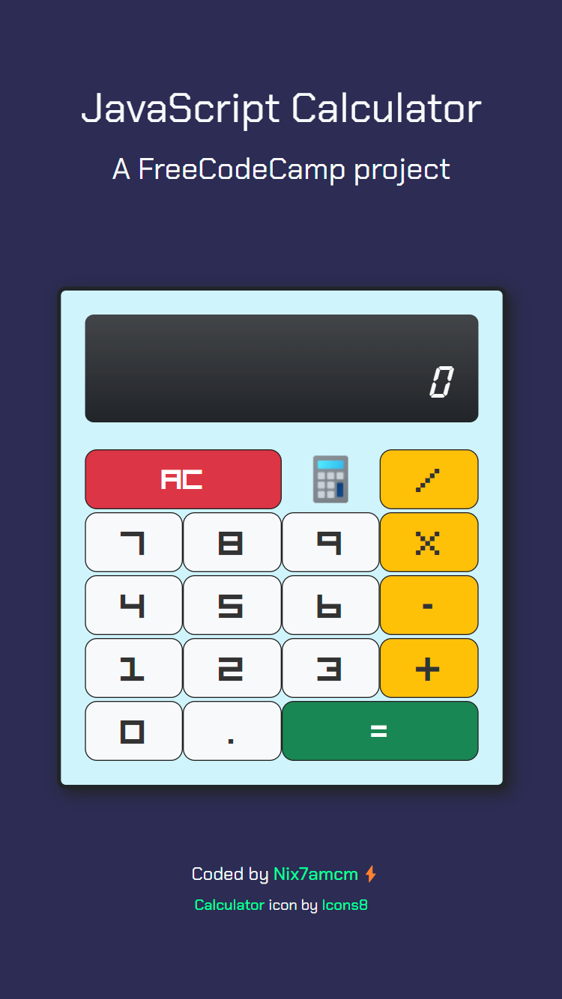

# JavaScript Calculator

This is a project for the freeCodeCamp Front End Libraries Certification. The project is to build a JavaScript calculator.

* * *

Table of Contents:
- [Images](#images)
- [Project Description](#project-description)
- [Additional Notes](#additional-notes)
- [Step-by-Step Guide to Implement the Calculator Logic](#step-by-step-guide-to-implement-the-calculator-logic)
- [Full `script.js` Code With Detailed Comments](#full-scriptjs-code-with-detailed-comments)


* * *

## Images:

#### <u>Desktop</u>



#### <u>Mobile</u>



* * *

## Project Description:

**Objective:**  Build an app that is functionally similar to this: [https://javascript-calculator.freecodecamp.rocks/](https://javascript-calculator.freecodecamp.rocks/).

Fulfill the below user stories and get all of the tests to pass. Use whichever libraries or APIs you need. Give it your own personal style.

You can use any mix of HTML, JavaScript, CSS, Bootstrap, SASS, React, Redux, and jQuery to complete this project. You should use a frontend framework (like React for example) because this section is about learning frontend frameworks. Additional technologies not listed above are not recommended and using them is at your own risk. We are looking at supporting other frontend frameworks like Angular and Vue, but they are not currently supported. We will accept and try to fix all issue reports that use the suggested technology stack for this project. Happy coding!

* * *

### User Stories

- [x] **User Story #1:** My calculator should contain a clickable element containing an `=` (equal sign) with a corresponding `id="equals"`.

- [x] **User Story #2:** My calculator should contain 10 clickable elements containing one number each from 0-9, with the following corresponding IDs: `id="zero"`, `id="one"`, `id="two"`, `id="three"`, `id="four"`, `id="five"`, `id="six"`, `id="seven"`, `id="eight"`, and `id="nine"`.

- [x] **User Story #3:** My calculator should contain 4 clickable elements each containing one of the 4 primary mathematical operators with the following corresponding IDs: `id="add"`, `id="subtract"`, `id="multiply"`, `id="divide"`.

- [x] **User Story #4:** My calculator should contain a clickable element containing a `.` (decimal point) symbol with a corresponding `id="decimal"`.

- [x] **User Story #5:** My calculator should contain a clickable element with an `id="clear"`.

- [x] **User Story #6:** My calculator should contain an element to display values with a corresponding `id="display"`.

- [x] **User Story #7:** At any time, pressing the `clear` button clears the input and output values, and returns the calculator to its initialized state; 0 should be shown in the element with the id of `display`.

- [x] **User Story #8:** As I input numbers, I should be able to see my input in the element with the id of `display`.

- [x] **User Story #9:** In any order, I should be able to add, subtract, multiply and divide a chain of numbers of any length, and when I hit `=`, the correct result should be shown in the element with the id of `display`.

- [x] **User Story #10:** When inputting numbers, my calculator should not allow a number to begin with multiple zeros.

- [x] **User Story #11:** When the decimal element is clicked, a `.` should append to the currently displayed value; two `.` in one number should not be accepted.

- [x] **User Story #12:** I should be able to perform any operation (`+`, `-`, `*`, `/`) on numbers containing decimal points.

- [x] **User Story #13:** If 2 or more operators are entered consecutively, the operation performed should be the last operator entered (excluding the negative (`-`) sign). For example, if `5 + * 7 =` is entered, the result should be `35` (i.e. `5 * 7`); if `5 * - 5 =` is entered, the result should be `-25` (i.e. `5 * (-5)`).

- [x] **User Story #14:** Pressing an operator immediately following `=` should start a new calculation that operates on the result of the previous evaluation.

- [x] **User Story #15:** My calculator should have several decimal places of precision when it comes to rounding (note that there is no exact standard, but you should be able to handle calculations like `2 / 7` with reasonable precision to at least 4 decimal places).

**Note On Calculator Logic:** It should be noted that there are two main schools of thought on calculator input logic: immediate execution logic and formula logic. Our example utilizes formula logic and observes order of operation precedence, immediate execution does not. Either is acceptable, but please note that depending on which you choose, your calculator may yield different results than ours for certain equations (see below example). As long as your math can be verified by another production calculator, please do not consider this a bug.

**EXAMPLE:** `3 + 5 x 6 - 2 / 4 =`

* **Immediate Execution Logic:** `11.5`
* **Formula/Expression Logic:** `32.5`

* * *

## Additional Notes:

You can build your project by [using this CodePen template](https://codepen.io/pen?template=MJjpwO) and clicking `Save` to create your own pen. Or you can use this CDN link to run the tests in any environment you like: `https://cdn.freecodecamp.org/testable-projects-fcc/v1/bundle.js`

Once you're done, submit the URL to your working project with all its tests passing.

**Note:** React 18 has known incompatibilities with the tests for this project (see [issue](https://github.com/freeCodeCamp/freeCodeCamp/issues/45922))


* * *

* * *

## Step-by-Step Guide to Implement the Calculator Logic

I entered my entire `script.js` code (with more detailed comments - provided below this) into ChatGPT. I asked it to 'reverse-engineer' it to create a detailed yet easy to follow step-by-step guide for creating the calculator logic. I did this so that I can return to this project at any time for help with future projects, or to remind myself of what I learned here. 


> ChatGPT has been an envaluable tool in my learning to code, mainly due to the ability to ask any and as many questions required to understand whatever I want or need, and therefore to learn in the way that I learn. Following other people's tutorials, guides, courses, videos, etc, are great tools for learning, but in most cases are only suitable if you think and learn exactly like the person creating them. For me, I often find something missing, or have simple questions that can't be unanswered, and am wasting valuable learning hours searching the internet to find answers just to help something 'click'.  ChatGPT is also excellent for help with troubleshooting, and for providing guides and code snippets. It is not 100% reliable, which in itself is a bonus, as it has been through troubleshooting and asking more questions that I am learning even more. 


Here is the guide to recreate my calculator logic:


1. **Wait for Document Ready**:
   Start by creating a jQuery `$(document).ready()` function. This function will run once the HTML document is loaded and the DOM is ready.
   
   ```javascript
   $(document).ready(function() {
     // All calculator code will go inside this function.
   });
   ```

2. **Initialize Variables**:
   Inside the `$(document).ready()` function, declare and initialize the following variables:
   
   - `currentOperand`: This will hold the current operand as a string, starting with `"0"`.
   - `previousOperand`: This will hold the previous operand as a string, starting empty.
   - `currentOperation`: This will hold the current operation as a string, initialized to `null`.
   - `shouldResetCurrentOperand`: A boolean flag to decide whether to reset the current operand, starting as `false`.
   - `maxDigits`: A constant set to the maximum number of digits allowed, for example, `15`.
   
   ```javascript
   let currentOperand = '0';
   let previousOperand = '';
   let currentOperation = null;
   let shouldResetCurrentOperand = false;
   const maxDigits = 15;
   ```

3. **Create Update Display Function**:
   Define a function `updateDisplay()` that will refresh the calculator's display. In this function:
   
   - Use jQuery to set the HTML content of the `.current-operand` and `.previous-operand` elements with the appropriate operand values.
   - Append the current operation to the previous operand display if it exists.
   
   ```javascript
   function updateDisplay() {
     $('.current-operand').html(currentOperand || '0');
     let previousDisplay = previousOperand;
     if (currentOperation != null) {
       previousDisplay += ' ' + currentOperation;
     }
     $('.previous-operand').html(previousDisplay || ' ');
   }
   ```

4. **Create Append Number Function**:
   Define a function `appendNumber(number)` that will append a number to the current operand. This function should:
   
   - Check if the current operand should be reset or is "0" to replace the current operand with the new number.
   - If not, append the number to the current operand if it doesn't exceed the maximum digits allowed.
   - Update the display after appending the number.
   
   ```javascript
   function appendNumber(number) {
     if (currentOperand === '0' || shouldResetCurrentOperand) {
       currentOperand = number;
     } else if (currentOperand.length < maxDigits) {
       currentOperand += number;
     } else {
       $('.current-operand').html('Max digits');
       setTimeout(updateDisplay, 1000);
     }
     shouldResetCurrentOperand = false;
     updateDisplay();
   }
   ```

5. **Create Append Decimal Function**:
   Define a function `appendDecimal()` that will append a decimal point to the current operand. Conditions similar to the `appendNumber` function should be used.
   
   ```javascript
   function appendDecimal() {
     if (shouldResetCurrentOperand || currentOperand === '0' || currentOperand === '') {
       currentOperand = '0.';
       shouldResetCurrentOperand = false;
       updateDisplay();
     } else if (!currentOperand.includes('.') && currentOperand.length < maxDigits) {
       currentOperand += '.';
       updateDisplay();
     }
   }
   ```

6. **Create Choose Operation Function**:
   Define a function `chooseOperation(operator)` that will set the current operation and move the current operand to the previous operand. This function should:
   
   - Perform the computation if there's an existing operation and the reset flag is not set.
   - Update the display after setting the operation.
   
   ```javascript
   function chooseOperation(operator) {
     if (currentOperand === '-' && currentOperation !== null) {
       currentOperand = '';
     }
   
     if (currentOperand !== '' || currentOperation === null) {
       if (currentOperation !== null && !shouldResetCurrentOperand) {
         compute();
       }
       previousOperand = currentOperand;
       currentOperation = operator;
       currentOperand = '';
       shouldResetCurrentOperand = true;
     } else if (currentOperation !== null && currentOperand === '' && operator !== '-') {
       currentOperation = operator;
     } else if (operator === '-') {
       currentOperand = '-';
       shouldResetCurrentOperand = false;
     }
   
     updateDisplay();
   }
   ```

7. **Create Compute Function**:
   Define a function `compute()` to perform the arithmetic operations. This function should:
   
   - Parse the `previousOperand` and `currentOperand` as floating-point numbers.
   - Use a `switch` statement to perform the operation based on `currentOperation`.
   - Update the operands and operation after the calculation.
   - Handle division by zero.
   - Truncate the result if necessary and update the display.
   
   ```javascript
   function compute() {
     let computation;
     const prev = parseFloat(previousOperand);
     const current = parseFloat(currentOperand);
     if (isNaN(prev) || isNaN(current)) return;
     switch (currentOperation) {
       // ... [cases for '+', '-', 'x', '/'] ...
     }
     previousOperand += ' ' + currentOperation + ' ' + currentOperand;
     const computationString = computation.toString();
     if (computationString.length > 15) {
       currentOperand = computationString.substring(0, 14) + '...';
     } else {
       currentOperand = computationString;
     }
     currentOperation = null;
     shouldResetCurrentOperand = true;
     updateDisplay();
   }
   ```

8. **Create Clear Function**:
   Define a function `clear()` that will reset all operands and the operation, and update the display.
   
   ```javascript
   function clear() {
     currentOperand = '0';
     previousOperand = '';
     currentOperation = null;
     shouldResetCurrentOperand = false;
     updateDisplay();
   }
   ```

9. **Add Event Listeners**:
   Add jQuery event listeners to bind click events to number buttons, operator buttons, the equals button, the clear button, and the decimal button.
   
   ```javascript
   $(".number").on('click', function() {
     const numberMap = { /* ... */ };
     const number = numberMap[this.id];
     appendNumber(number);
   });
   
   $(".operator").on('click', function() {
     const operatorMap = { /* ... */ };
     const operator = operatorMap[this.id];
     chooseOperation(operator);
   });
   
   $("#equals").on('click', function() {
     if (currentOperation !== null) {
       compute();
     }
   });
   
   $("#clear").on('click', function() {
     clear();
   });
   
   $("#decimal").on('click', function() {
     appendDecimal();
   });
   ```

10. **Initialize Display**:
    Finally, call `updateDisplay()` to initialize the display at the end of your `$(document).ready()` function.
    
    ```javascript
    updateDisplay();
    ```
    
    

***

## Full `script.js` Code With Detailed Comments

I used Github Copilot to help create this logic. Like ChatGPT, I have found it an envaluable tool for learning to code, and coding in general. It can explain, troubleshoot or provide code. Its autocomplete capabilities have greatly increased the speed which I can create and learn from projects.

When I finished, I highlighted my entire code and asked Copilot to add detailed comments, which will be so helpful for returning to this project or anyone else viewing the code.

```js
//**** Create a jQuery function to run when the document loads and the DOM is ready:
$( document ).ready( function () {
  let currentOperand = '0'; //--- Current operand value
  let previousOperand = ''; //--- Previous operand value
  let currentOperation = null; //--- Current operation
  let shouldResetCurrentOperand = false; //--- Flag to reset current operand
  const maxDigits = 15; //--- Max digits allowed in the current operand


  //_____ Update the display with curr & prev operands:
  function updateDisplay () {
    //>>> Update the current operand display with the currentOperand value or '0' if it's empty:
    $( '.current-operand' ).html( currentOperand || '0' );
    //>>> Set the previousDisplay variable to the value of previousOperand:
    let previousDisplay = previousOperand;
    //>>> If there is a current operation, append it to the previousDisplay:
    if ( currentOperation != null ) {
      previousDisplay += ' ' + currentOperation;
    }
    //>>> Update the previous operand display with the previousDisplay value or ' ' if it's empty:
    $( '.previous-operand' ).html( previousDisplay || ' ' );
  }


  // _____ Append a number to the current operand:
  function appendNumber ( number ) {
    //>>> If the current operand is '0' or shouldResetCurrentOperand flag is true, set the current operand to the number:
    if ( currentOperand === '0' || shouldResetCurrentOperand ) {
      currentOperand = number;
      //>>> If the length of the current operand is less than maxDigits, append the number to the current operand:
    } else if ( currentOperand.length < maxDigits ) {
      currentOperand += number;
    } else {
      //>>> If the number exceeds maxDigits, display a message:
      $( '.current-operand' ).html( 'Max digits' ); //--- Display 'Max digits' in the current operand display
      setTimeout( updateDisplay, 1000 ); //--- Show the message for 1 second
      return; //--- Exit the function to prevent immediate updateDisplay call
    }

    //>>> Reset the shouldResetCurrentOperand flag to false:
    shouldResetCurrentOperand = false;
    //>>> Update the display with the new current operand value:
    updateDisplay();
  }


  //_____ Append a decimal point to the current operand:
  function appendDecimal () {
    //>>> If the shouldResetCurrentOperand flag is true or the current operand is '0' or empty, set the current operand to '0.':
    if ( shouldResetCurrentOperand || currentOperand === '0' || currentOperand === '' ) {
      currentOperand = '0.'; //--- Set the current operand to '0.'
      shouldResetCurrentOperand = false; //--- Reset the shouldResetCurrentOperand flag to false
      updateDisplay(); //--- Update the display with the new current operand value
      //>>> If the current operand does not already include a decimal point and its length is less than maxDigits, append a decimal point to the current operand:
    } else if ( !currentOperand.includes( '.' ) && currentOperand.length < maxDigits ) {
      currentOperand += '.'; //--- Append a decimal point to the current operand
      updateDisplay(); //--- Update the display with the new current operand value
    }
  }


  //_____ Choose an operation:
  function chooseOperation ( operator ) {
    //>>> If the last character of currentOperand is '-' and currentOperation is not null, clear currentOperand:
    if ( currentOperand === '-' && currentOperation !== null ) {
      currentOperand = '';
    }

    //>>> If currentOperand is not empty or currentOperation is null, perform computation:
    if ( currentOperand !== '' || currentOperation === null ) {
      //>>> If currentOperation is not null and shouldResetCurrentOperand is false, perform the computation:
      if ( currentOperation !== null && !shouldResetCurrentOperand ) {
        compute();
      }
      previousOperand = currentOperand; //--- Move the current operand to previous to prepare for a new value
      currentOperation = operator; //--- Set the new operator
      currentOperand = ''; //--- Clear the current operand for a new entry
      shouldResetCurrentOperand = true; //--- The next input starts a new operand
    } else if ( currentOperation !== null && currentOperand === '' && operator !== '-' ) {
      //>>> If the current operand is empty and the operator is not '-', update the current operation:
      currentOperation = operator;
    } else if ( operator === '-' ) {
      //>>> If the operator is '-', it means we are entering a negative number:
      currentOperand = '-';
      shouldResetCurrentOperand = false;
    }

    updateDisplay();
  }


  //_____ Perform the computation:
  function compute () {
    let computation; //--- Variable to store the computation result
    const prev = parseFloat( previousOperand ); //--- Convert previousOperand to a floating-point number
    const current = parseFloat( currentOperand ); //--- Convert currentOperand to a floating-point number
    if ( isNaN( prev ) || isNaN( current ) ) return; //--- If either prev or current is NaN (Not a Number), return

    //>>> Perform the computation based on the current operation:
    switch ( currentOperation ) {
      case '+':
        computation = prev + current; //--- Perform addition
        break;
      case '-':
        computation = prev - current; //--- Perform subtraction
        break;
      case 'x':
        computation = prev * current; //--- Perform multiplication
        break;
      case '/':
        if ( current === 0 ) {
          alert( "Cannot divide by zero" ); //--- Display an alert if attempting to divide by zero
          return;
        }
        computation = prev / current; //--- Perform division
        break; //--- Exit the switch statement
      default:
        return; //--- If currentOperation is not one of the above cases, return without performing any computation
    }

    //>>> Set the previousOperand to the computation result and append the current operation and current operand to it:
    previousOperand += ' ' + currentOperation + ' ' + currentOperand;
    //>>> Convert the computation result to a string:
    const computationString = computation.toString();

    //>>> Check if computationString is longer than 16 characters before adding '...':
    if ( computationString.length > 15 ) {
      currentOperand = computationString.substring( 0, 14 ) + '...'; //--- Truncate the computation result and add '...' if it exceeds 16 characters
    } else {
      currentOperand = computationString; //--- Set the currentOperand to the computation result
    }

    //>>> Reset the currentOperation:
    currentOperation = null;
    //>>> Set the shouldResetCurrentOperand flag to true:
    shouldResetCurrentOperand = true;
    //>>> Update the display with the new values:
    updateDisplay();
  }


  //_____ Clear the calculator:
  function clear () {
    currentOperand = '0'; //--- Reset the currentOperand to '0'
    previousOperand = ''; //--- Reset the previousOperand
    currentOperation = null; //--- Reset the currentOperation
    shouldResetCurrentOperand = false; //--- Reset the shouldResetCurrentOperand flag to false
    updateDisplay(); //--- Update the display with the new values
  }


  //_____ Event listener for number buttons:
  $( ".number" ).on( 'click', function () {
    //>>> Define a numberMap object that maps button ids to their corresponding numbers:
    const numberMap = {
      zero: '0',
      one: '1',
      two: '2',
      three: '3',
      four: '4',
      five: '5',
      six: '6',
      seven: '7',
      eight: '8',
      nine: '9'
    };

    //>>> Get the corresponding number from the numberMap based on the clicked button's id:
    const number = numberMap[ this.id ];
    //>>> Append the number to the current operand:
    appendNumber( number );
  } );


  //_____ Event listener for operator buttons:
  $( ".operator" ).on( 'click', function () {
    //>>> Define an operatorMap that maps button ids to their corresponding symbols:
    const operatorMap = {
      add: '+',
      subtract: '-',
      multiply: 'x',
      divide: '/'
    };

    //>>> Get the corresponding operator from the operatorMap based on the clicked button's id:
    const operator = operatorMap[ this.id ];
    //>>> Choose the operation based on the clicked operator:
    chooseOperation( operator );
  } );


  //_____ Event listener for equals button:
  $( "#equals" ).on( 'click', function () {
    if ( currentOperation !== null ) {
      compute(); //--- Perform the computation if there is a current operation
    }
  } );


  //_____ Event listener for clear button:
  $( "#clear" ).on( 'click', function () {
    clear(); //--- Clear the calculator
  } );


  //_____ Event listener for decimal button:
  $( "#decimal" ).on( 'click', function () {
    appendDecimal(); //--- Append a decimal point to the current operand
  } );


  //_____ Initialize the display:
  updateDisplay();
} );
```
